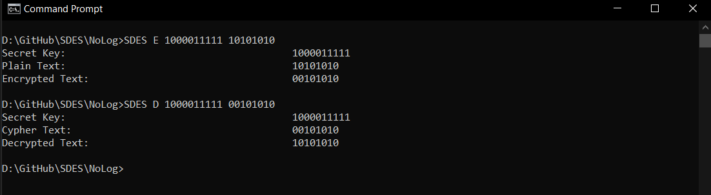
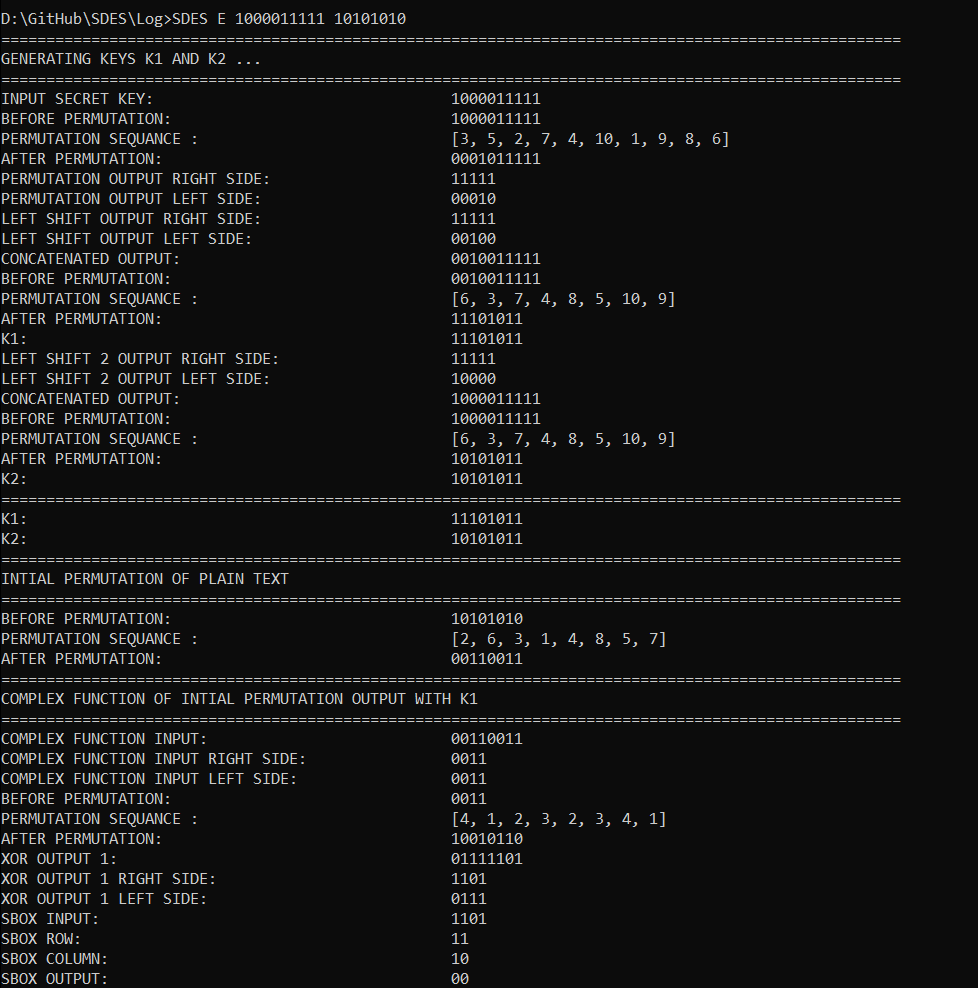
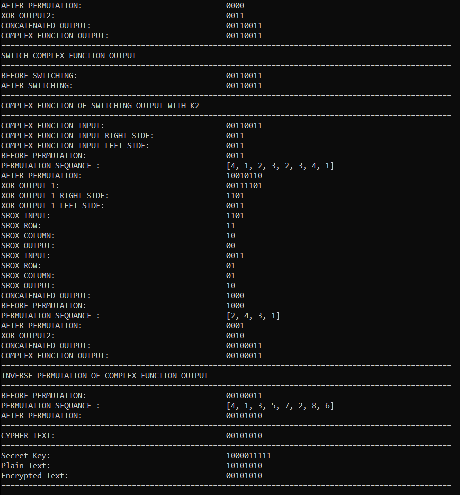

# SDES
Implementation of Simplified Data Encryption Standard

## From Terminal
No logging - > Log/SDES.exe
logging    - > Log/SDES.exe

## Input Form
Encryptrion: SDES [E] [input secret Key] [Plain Text]
Decryption : SDES [D] [input secret Key] [Cypher Text]

## Output Without Logging

## Output With Logging

## Youtube
Video Link: https://www.youtube.com/watch?v=sj2jnr3wlFc
